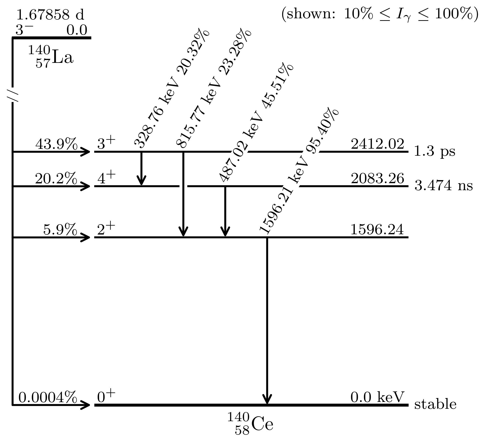

# Decay Scheme Plotter

Python script to parse and plot decay schemes from Evaluated Nuclear Structure Data ([ENSDF](https://www.nndc.bnl.gov/ensdf/)) files. 

## How to use

Download the data you want from ENSDF. Note that if you, for instance, want to plot the decay of La-140, you must search for its daughter, Ce-140. Then click the dataset you wish to use, which in the example above is "140LA B- DECAY". Download as ENSDF text format. 

To run the python script, you can run something like ```python3 plot_scheme.py -f ensdf_files/140la.txt```. Other flags are ```-s``` for a figure save path, ```-imin``` for the minimum gamma instensity to plot, and ```-imax``` for the maximum gamma intensity to plot. 

Results can look something like this: 



Gamma intensities are per decay (or per 100 decays since they are in percent). They are not relative intensities. The same is true for the decay intensity. 

## Limitations

Only looks good for beta minus decay at the moment. Might be extended to other decay modes in the future. 
